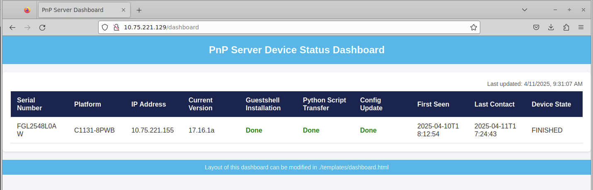

## Intro
This is a Cisco PnP server written in Python Flask, which runs HTTP services and makes use of the Cisco PnP protocol to provision Cisco IOS-XE devices automatically.

This project is developed specially for ISR1k routers, which by default do not have Guestshell equipped, thus cannot run ZTP Python scripts. This PnP Server is able to:
 - Update device day-0 configuration
 - Upgrade and run new image
 - Transfer generic files (e.g. Guestshell tarball, Python script) from server onto device bootflash
 - Install and enable Guestshell and run the Python script

Please glance through [this post](https://developer.cisco.com/site/open-plug-n-play/learn/learn-open-pnp-protocol/) to get a brief idea of PnP protocol before you move on.

## PnP Workflow
With PnP server and DHCP server being set up properly, we can achieve such workflow automatically:

 1. New ISR1k boots up, it will broadcast a [*DHCP Discover*](https://en.wikipedia.org/wiki/Dynamic_Host_Configuration_Protocol#Operation) message, trying to get an IP address. The *DHCP Discover* message contains string "ciscopnp" in option 60, and device PID (for example "C1131-8PWB") in option 124.
 2. The DHCP server should have been previously configured to identify  “ciscopnp” in Option 60 and device PID in option 124. It will respond a *DHCP Offer* message, with the PnP server IP address hardcoded in option 43.
 3. If no startup-config is present in NVRAM, the device will enter PnP workflow and connect to the PnP server
 4. PnP server sends CLI to set the config-register value of device (for ISR1k should be 0x2102)
 5. PnP server sends CLI “_write memory_” to ISR1k, so its config-register and PnP connection info are saved
 6. PnP server checks the image version which the ISR1k is currently running at
 7. If image version does not match with the one defined in settings.py, PnP server sends the new IOS image to ISR1k, ISR1k copies it into bootflash
 8. ISR1k automatically reloads itself. And then boots up with the new image.
 9. PnP server transfers the Guestshell tarball & Python script to the device bootflash.
 10. PnP server sends the day-0 config to the device. The day-0 config contains a event manager applet "InstallGuestShell", which can be triggered later to install and enable Guestshell. Please refer to configs/default.cfg for this event manager. It can be modified at your will.
 11. PnP server checks the bootflash free space. Guestshell installation requires 1GB of space. If there's less space than 1GB, PnP server will stop, with the "Device State" column in DEVICE_STATUS.csv showing "BOOTFLASH_NO_SPACE". If you are seeing this state, please clear the bootflash on device, check the free size by CLI "dir bootflash:", make sure it is larger than 1GB, and change the "Device State" in DEVICE_STATUS.csv from "BOOTFLASH_NO_SPACE" to "RUN_EVENT_MANAGER". Then the PnP workflow on the device will automatically proceed in a while.
 12. PnP server triggers the event manager applet "InstallGuestShell" to install and enable the Guestshell.
 13. Finally PnP server asks the device to run the Python script in Guestshell environment.

Please note this is a run-to-completion model. No need for users to interfere (unless bootflash free space is not sufficient at step 11). All you need to do is to boot up the ISR1k device, sit down and wait.  Please make sure the ISR1k device boots up with no start-up config, otherwise the PnP workflow won't kick in.

## Configuration Steps
### Step 1
Choose the server pod in your environment to host the PnP services. This will be our PnP server. It should be in the same subnet with the ISR1k devices so it is reachable by them. Find out the IP address of our PnP server. (In this example it is *10.2.3.4*).
### Step 2
Configure the DHCP server. Make sure it is able to identify string "ciscopnp" in option 60, and string "C11" in option 124 of a DHCP message, and will respond with PnP server address in option 43. In our example here, option 43 will be "5A;B2;K4;I10.2.3.4;J80".
Syntax explanation:
```
"5A;B2;K4;I10.24.67.108;J80"
5 – DHCP type code 5
A – Active feature operation code
B2 – PnP server IP address type is IPv4
I10.2.3.4 – PnP server IP address
J80 – Port number 80 (use HTTP service)
```
If you are using a Linux server (especially Ubuntu) as the DHCP server in your environment, one way to achieve this is to run `sudo vim /etc/dhcp/dhcpd.conf` , and add these lines of code to the *dhcpd.conf* file:
```
option space CISCO_PNP;
option CISCO_PNP.pnpserver code 43 = string;
option ClientPID code 124 = string;
class "ciscopnp-isr1k" {
match if option vendor-class-identifier = "ciscopnp" and substring(option ClientPID, 6, 3) = "C11";
vendor-option-space CISCO_PNP;
option CISCO_PNP.pnpserver "5A;B2;K4;I10.2.3.4;J80";
}
```
By identifying "C11" in device PID, the DHCP server will send the PnP server IP address to ISR1k devices ONLY, other types of devices (ISR4k, CAT9k etc) are NOT affected. They will not get such option 43, and will still follow their own provisioning workflow (ZTP etc).

Again, please remember to change *10.2.3.4* in the code above to your PnP server address.

Then save the *dhcpd.conf* file, restart the DHCP service, and check if it is actively running:
```
$ sudo systemctl restart isc-dhcp-server

$ sudo systemctl status isc-dhcp-server
```

### Step 3
Git clone this repo into the PnP server.

Install all of the modules that this repo depends on:
```
pip3 install -r requirements.txt
```

Edit *settings.py* to set up the environment variables (server IP address, config file name, guestshell tarball file name, python script name).

Then please
 1. Put the image file you want the devices to upgrade with to the ./images folder, 
 2. Put the config files to the ./configs folder. Name the config file with device serial number, e.g. 'FGL2548L0AW.cfg'. Then each device will fetch its own config. However if it cannot find a .cfg named by its own serial number, it will simply fetch the default.cfg in ./configs folder. So make sure you edit the default.cfg to match your needs.
 3. Put the file which you want to transfer under ./files folder, for example *guestshell.17.09.01a.tar* and *pxs.py*.

### Step 4
Now you should be ready to go. Run the entry point script:

     $ sudo python3 ./run.py

You should be able to see this output in your console. Please double check if the IP address and directories are correct. Otherwise the devices are not able to get what they want.
```
Running PnP server. Stop with ctrl+c

Bind to IP-address      : 10.2.3.4
Listen on port          : 80
Image file(s) base URL  : http://10.2.3.4/images
Config file(s) base URL : http://10.2.3.4/configs

 * Serving Flask app 'run'
 * Debug mode: off
```
Then boot up all the ISR1k devices. Please make sure they are either new devices or  have been factory-reset. They will not enter the PnP workflow if startup-config exists.

When the PnP server is running, you can view device status through the web dashboard at http://your-server-ip/dashboard

The ISR1k image file is 700+MB, the entire workflow should take some time.

If you see "FINISHED" in the last column, then this device have finished all 13 steps in the PnP workflow mentioned above.

Detailed log file can be found at *logs/pnp_debug.log*.

## Database Setup
This PnP server supports MariaDB database-based storage for device state persistence. Using a database offers better reliability and concurrent access. Follow these steps to set up the database:

### Option 1: Install and Setup MariaDB Locally

1. **Install MariaDB on your local server**

     ```bash
     # Install MariaDB if not already installed
     # For Ubuntu/Debian
     sudo apt update
     sudo apt install mariadb-server
     
     # For CentOS/RHEL
     sudo yum install mariadb-server mariadb
     
     # Start MariaDB service
     sudo systemctl start mariadb
     # Enable MariaDB to start automatically on boot
     sudo systemctl enable mariadb
     # Check if MariaDB is actively running
     sudo systemctl status mariadb
     ```

2. **(Optional) Secure your MariaDB installation**

     ```
     sudo mysql_secure_installation
     ```
     (Optional) You will be guided by the prompts to:
     - Set a root password
     - Remove anonymous users
     - Disallow root login remotely
     - Remove test database
     - Reload privilege tables

3. **Create a database and user**

     ```bash
     sudo mysql -u root -p
     ```

     Then in the MySQL prompt:

     ```sql
     CREATE DATABASE pnp_db;
     CREATE USER 'pnp_user'@'localhost' IDENTIFIED BY 'pnp_password';
     GRANT ALL PRIVILEGES ON pnp_db.* TO 'pnp_user'@'localhost';
     FLUSH PRIVILEGES;
     EXIT;
     ```
     Remember to replace 'pnp_password' with a stronger one if necessary.

4. **Update Database Configuration**
     
     Edit the settings.py file to include your database credentials:
     ```python
     # Database Configuration
     db_config = {
          'host': '127.0.0.1',
          'port': 3306,
          'user': 'pnp_user',
          'password': 'pnp_password',  # Use the password you created
          'database': 'pnp_db'
     }
     ```

### Option 2: Use a Remote MariaDB Server

1. **Ensure you have the connection details for your remote MariaDB server (hostname, port, username, password).**

2. **Create a database and grant access on remote server**

     ```sql
     CREATE DATABASE pnp_db;
     CREATE USER 'pnp_user'@'%' IDENTIFIED BY 'pnp_password';
     GRANT ALL PRIVILEGES ON pnp_server.* TO 'pnp_user'@'%';
     FLUSH PRIVILEGES;
     ```
     Note: The '%' allows connection from any host. For better security, use your PnP server's specific IP address.
3. **Make sure the remote server's firewall allows connections on the MariaDB port (default 3306)**

4. **Update Database Configuration**
     
     Edit the settings.py file with remote server details:
     ```python
     # Database Configuration
     db_config = {
          'host': 'remote_server_ip',  # Replace with your remote server IP
          'port': 3306,
          'user': 'pnp_user',
          'password': 'pnp_password',  # Use the password you created
          'database': 'pnp_db'
     }
     ```

### Testing the Database Connection

1. **Run the test script to verify your database connection**
```bash
python3 ./app/database/test_db_connection.py
```
Luckily you should be able to see "MariaDB connection is successful!"

2. **Troubleshooting**:
   - If you get "Error connecting to MariaDB: Can't connect to local MySQL server through socket", ensure MariaDB is running
   - For "Access denied" errors, verify your username, password, and privileges
   - For "Host is not allowed" errors, check your user's allowed hosts and firewall settings

Once your database connection is working, the PnP server will automatically create the necessary tables on first run.

## Web Dashboard

The PnP Server includes a web dashboard that displays the status of all devices in real-time. You can access it by visiting `http://your-server-ip/dashboard` (or `http://localhost/dashboard` for local usage) in your browser.



The dashboard automatically refreshes every 5 seconds to show the most current device status.